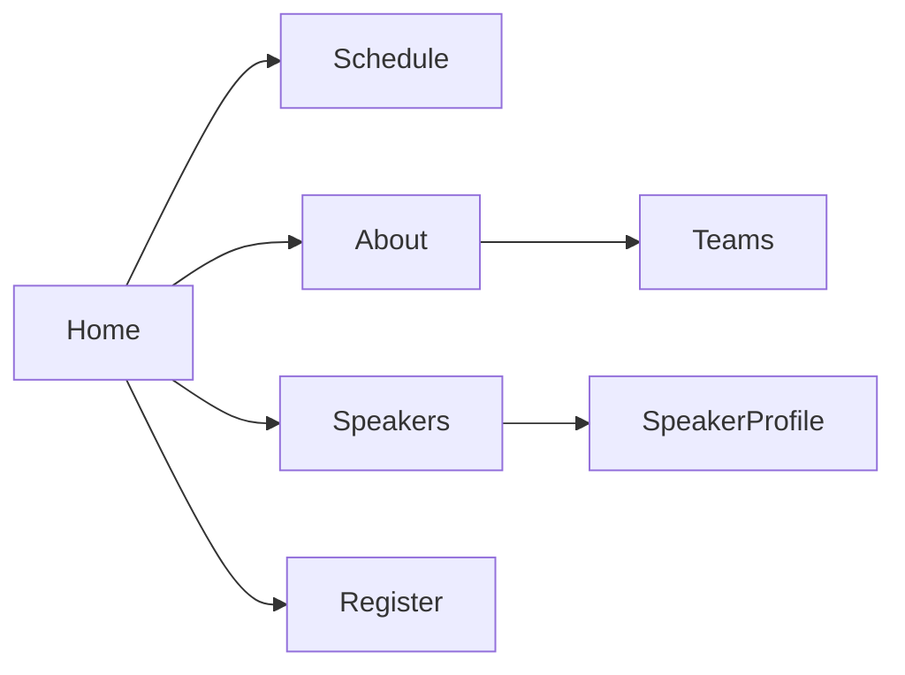
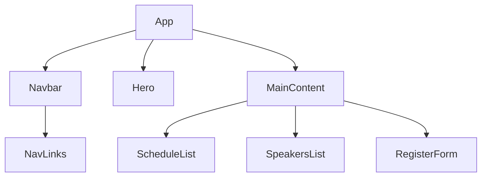

# Executive Summary  
Stylish event sites blend bold heroes, clear CTAs, and rich info. For example, the Web Summit Vancouver site uses a catchy hero tagline “Join the world’s premier tech conference” with big CTAs. Next.js Conf has a clean hero announcing dates plus a simple “Register” link. Five Talks (Motion) animation loops a tagline in hero to set theme. These examples use sticky navs or sections for speakers/schedule and emphasize clear registration flows. 

## 1. Competitive UX Patterns  
- **Web Summit Vancouver** – Hero: tagline “Join us at Vancouver Convention Center…” with CTAs “Get 50% off”, “Exhibit”. Discovery: speakers list, press quotes; Registration: pop-up or top “Get 50% off”. *Borrow:* strong social proof (press quotes, logos) and immediate multiple CTAs.  
- **Next.js Conf (Vercel)** – Hero: “Next.js Conf 2025” big title, tagline, “Register” CTA; nav includes “Speakers”, “Schedule”. *Borrow:* minimalist layout and clear registration prompt.  
- **Five Talks (Motion)** – Hero: animated repeating tagline (“Emotion through motion…”), “Sold Out” indicator; sections for event details and speakers. *Borrow:* immersive text animation overlaid on hero.  
- **Phocuswright Conference** – Hero: bold header “Where Travel’s Power Players Converge” plus date/location, dual “Register” buttons with pricing. Discovery: sticky multi-level nav, program highlights, countdown timer. *Borrow:* prominent countdown and tiered CTA to drive urgency.  
- **Coworking Europe (2026)** – Hero with full-bleed video/parallax, simple CTA; sticky menu to news and “Book Tickets”. *Borrow:* parallax video background with fade effect for performance and visual interest.  

## 2. Visual Asset Research  
- **Font pairs (Google Fonts)** – Examples: *Cinzel Decorative* (display) + *Libre Franklin* (sans)；*UnifrakturMaguntia* (display) + *Montserrat*；*Old Standard TT* (serif) + *PT Sans*；*Pirata One* (ornate) + *Roboto*. (All on Google Fonts, open-source).  
- **Textures** – Parchment/paper: Pixabay has **1,071 free parchment images** (CC0). Unsplash and Pexels likewise.  
- **Particle/Starfield effects** – **particles.js** (MIT, ≈40KB) for canvas particles; **Animated Starfield** CodePen by kirupa: examples of 3D starfield. (tsParticles is a modern alternative).  
- **Candle-glow effects** – Free PNG overlays: Vecteezy’s “Fire Glow” collection offers **5,270 free glow PNGs**. CSS: use radial-gradient or box-shadow for soft light leaks.  
- **Icon packs (magical theme)** – Flaticon “Magic Line” pack (30 SVGs, free with attribution); minimalist sets like Feather Icons or Material Icons (open-source) can substitute generic symbols (star, spark, wand silhouette).  
- **Scroll/hover libraries (<50KB)** – *ScrollReveal.js* (~5KB gzipped) or *AOS (Animate On Scroll)* (~12KB gzipped) for reveal on scroll; *Hover.css* for glow; small JS like **Microdot** or **Lax.js** for subtle parallax. (All MIT/Apache licensed).  

## 3. Staying Original / Copyright-Safe  
By IP law, **ideas/concepts aren’t protected, only specific expressions**. That means a “magic school” theme is fine, but not Hogwarts names/logos. Avoid direct Harry Potter trademarks (names, house symbols, spells, e.g. “Harry Potter”, Deathly Hallows). **Concrete swaps:**  
- *House crests* → **Original guild emblems** (e.g. “Lioncrest Guild” instead of Gryffindor; use generic animal/logos).  
- *Sorting ceremony* → **Initiation or Calling Ceremony** (no “Sorting Hat”; maybe an oracle or quiz).  
- *Spells/Incantations* → **Unique “power words”** (avoid exact spell names; make up new words).  
- *Platform 9¾* → **Hidden Station** (e.g. “Platform X” or “Secret Portal” wording).  
- *Patronus* → **Spirit Guide or Guardian Creature** (use generic animal shapes, no “Expecto Patronum”).  
This respects the “idea vs expression” rule by reusing atmosphere without infringing on canon trademarks or copyrighted text.

## 4. MVP Plan (React + Netlify, Frontend only)  
- **Pages/Routes**: Home, About, Schedule/Tracks, Speakers, Gallery, Register, Contact (Table below). Keep minimal animations: hero reveal, hover glows, particle background.  
- **Components**: Navbar, Hero, EventList/Schedule, SpeakerCard, Footer, etc (hierarchy diagram below). Use React functional components, CSS modules or Tailwind. Static JSON or Google Sheets (CSV) as data source.  
- **Performance/SEO**: Lazy-load images, minimize libs (<50KB), optimize fonts (subset, preconnect).  
- **Deployment**: Push to Netlify (auto-deploy from GitHub); enable Netlify forms for RSVP or Firebase+Netlify for submissions.  

**Pages Table (for Google Sheets)**: 

| Page      | Priority | Key Content                         |
|-----------|----------|-------------------------------------|
| Home      | 1        | Hero (tagline + CTA), highlights    |
| About     | 2        | Event theme description, date/venue |
| Schedule  | 1        | Track list, timetable, filters      |
| Speakers  | 1        | Grid of speakers, bios, filters     |
| Register  | 1        | Tickets/pricing, signup form/links  |
| Gallery   | 3        | Past event photos (optional)        |
| Contact   | 3        | Info, social links                  |

**Components Table**:

| Component    | File              | Purpose                                 |
|--------------|-------------------|-----------------------------------------|
| Navbar       | `Navbar.js`       | Top navigation (sticky, logo, links)    |
| Hero         | `Hero.js`         | Landing section with heading/CTA, effect|
| ScheduleList | `ScheduleList.js` | List of sessions/tracks (page)         |
| SpeakerCard  | `SpeakerCard.js`  | Displays individual speaker info       |
| Footer       | `Footer.js`       | Contact/social links, newsletter form    |

**Sources:** Real event sites and assets libraries (e.g. Web Summit, particles.js repo, Pixabay). Each recommendation is based on current design patterns and licenses.